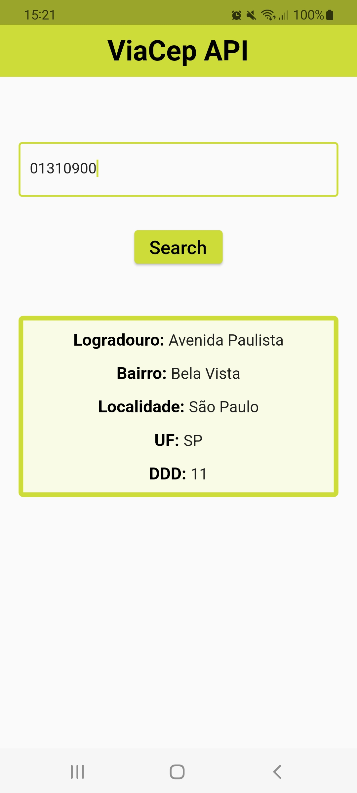
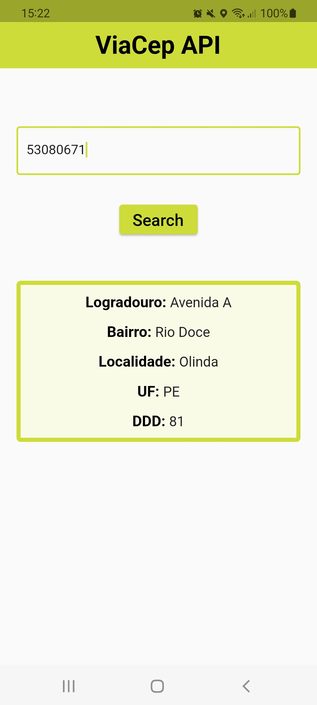
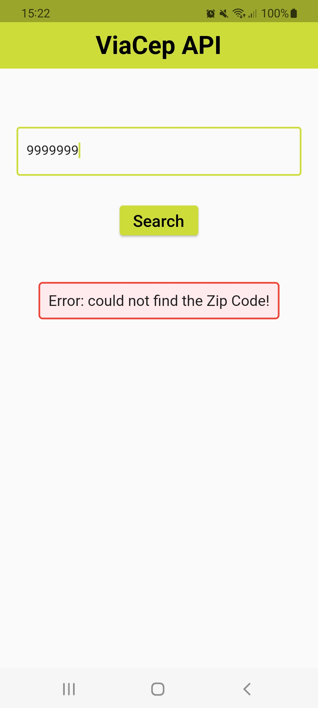
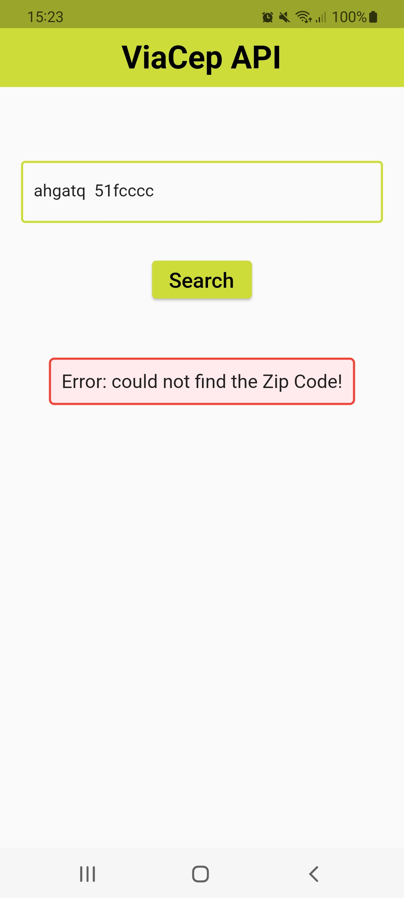

# Zip Code Search App

This app searches for any valid Zip Code inside Brazil.

  
  
  
  

# App Overview
 

This app displays the correct information about the valid Zip Code found. When the Zip Code is invalid, it shows an error message.
This app is composed by: ViaCep API, Bloc for state management and GetIt as service locator and dependency injection.

# Supported State Management Solutions
  
- [Bloc](https://pub.dev/packages/flutter_bloc)
  
# Packages 

- [Dio](https://pub.dev/packages/dio)
- [GetIt](https://pub.dev/packages/get_it)

# Future Roadmap

- N/A
